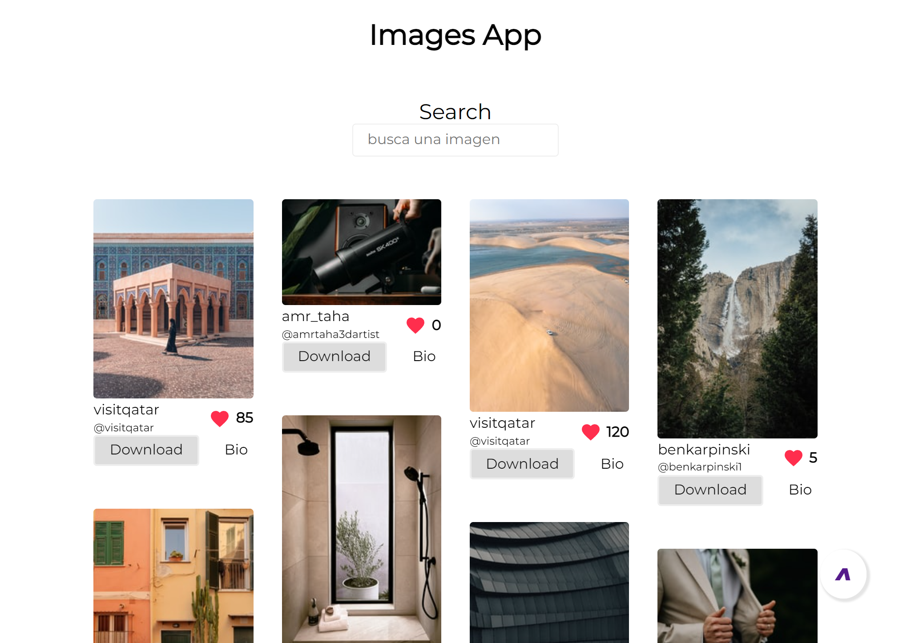
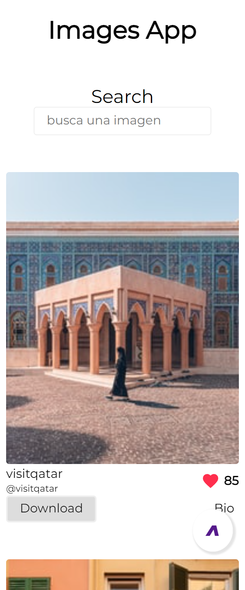

# Images App Unsplash
esta aplicacion es para finez didacticos usa la api de Unsplash
para mostrar las imagenes que el usuario pida.

## esta construida con:
* Javascript
* Html
* Css

### para ejecutar el proyecto
ejecute 
```
git clone https://github.com/Kevin-Illu/Codigo-Morse-App.git
```
abra el archivo html y listo ejecute live-server o algo similar y listo.

### imagesnes de referencia

